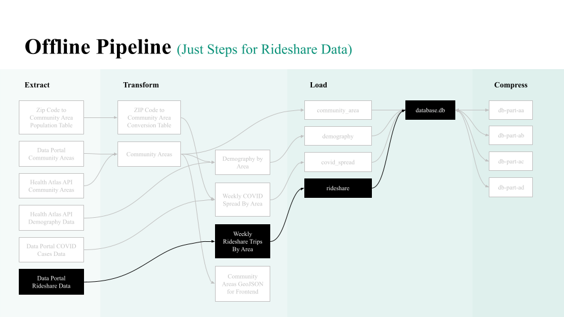

# Adding a New Dataset

This guide walks you through how to add a new dataset to the offline pipeline.

## Contents

- [Tips](#tips)
    - [Terminology](#terminology)
    - [Terminal Tips](#terminal-tips)
    - [Questions to Consider](#questions-to-consider)
    - [Pull Requests](#pull-requests)
- [Instructions](#instructions)
    - [1. Extract](#1-extract)
    - [2. Transform](#2-transform)
    - [3. Load](#3-load)

## Tips

### Terminology

- **ETL Pipeline:** Extract, transform, and load pipeline, the way we organize data processing steps
    - **Pipeline:** a series of data processing steps
    - **Extract:** to get data from an external source
    - **Transform:** to convert data from one form to another
    - **Load:** to export data for other systems to use
- **CLI:** Command Line Interface, the format for commands that can run in a terminal
- **SoQL:** Socrata Query Language, a dialect of SQL for accessing data portal datasets

### Terminal Tips

All file paths in the offline pipeline are relative to the `pipeline/` directory. When working on the offline pipeline, it is recommended that you enter the `pipeline/` folder:

```bash
cd pipeline
```

You can run any `make` command from this folder by typing:

```bash
make NAME_OF_TARGET
```

### Questions to Consider

Besides coding, you might get stuck on questions about the product and datasets. These are good questions to review with your mentor, to check your understanding and ask for advice:

- Why do we want to include this dataset?
- Does the data source contain the information we need? Do we need to join it with other datasets?
- What are some of the limitations of the dataset or things to keep in mind when using it?
- What steps are needed to transform this data from its current state to the state we want?

### Pull Requests

The first time you add a new dataset, we recommend you do it over three separate pull requests (PRs):

- PR#1 to extract data
- PR#2 to transform data
- PR#3 to load data

This makes it easier for your reviewer to follow the changes you are making. In the future, or if you feel the changes make more sense together, you can do all or some of those steps in a single pull request.

Remember to [keep your branch updated](git.md#update-your-branch)!

## Instructions

There are three steps to add a new dataset to our offline pipeline:

1. Extract data from external sources
    - Write the code to extact a dataset
    - Add the extract step to `Makefile`
    - Run the extract step to check if it worked
2. Transform data into the desired format
    - Write the code to transform a dataset
    - Add the transform step to `Makefile`
    - Run the transform step to check if it worked
3. Load data into the database
    - Write a SQLite schema for the new table
    - Add the load step to `Makefile`
    - Run the load step to check if it worked
    - Write data quality tests for the real version of the new table

For example, here is how the rideshare dataset fits into the offline pipeline:



## 1. Extract

- Code used to extract data should go in the `pipeline/extract/` directory.
- Data produced by extract steps should go in the `pipeline/data/extracted` folder.

There are three external sources we extract data from:

- A. [Chicago Data Portal](https://data.cityofchicago.org/)
- B. [Chicago Health Atlas API](https://chicagohealthatlas.org/api/v1/)
- C. Raw URL

Figure out where the dataset you want to extract comes from and read the corresponding subsection.

### A. Extract from the Chicago Data Portal

The Python script `pipeline/extract/from_data_portal.py` helps you extract data from the data portal by writing a SoQL query.

- Find the dataset you want to extract from [the data portal](https://data.cityofchicago.org/)
- Get the JSON URL for the dataset
    - Find the API button in the top-right corner, select the JSON endpoint, then click copy


- Write a SoQL query to get the data you want
    - Read [Socrata Query Language (SoQL)](soql.md) for a guide on how to write and run queries
- Write a `Makefile` step in the extract section

An example of a dataset extracted from the data portal is the rideshare data.

This is the SoQL query to get the rideshare data from the data portal dataset:

```sql
SELECT
    date_trunc_ymd(trip_start_timestamp) as ymd,
    pickup_community_area,
    dropoff_community_area,
    count(1) as n_trips
GROUP BY ymd, pickup_community_area, dropoff_community_area
LIMIT 190000000
```

Usually, we don't want to do any transformation in the extract step, but the rideshare trips dataset has over 190 million rows, so it would take too long to download the un-aggregated version. This query gets the total number of trips for each day, pickup community area, and dropoff community area, which results in approximately 3.6 million rows.

This is the `make` step for extracting the rideshare data from the data portal:

```make
PORTAL_RIDESHARES := https://data.cityofchicago.org/resource/m6dm-c72p.json

data/extracted/daily_rideshare.csv:
    python3 extract/from_data_portal.py \
        --json_url="$(PORTAL_RIDESHARES)" \
        --soql_file="extract/daily_rideshare.sql" \
        --output_file="data/extracted/daily_rideshare.csv"
```

To use the `extract/from_data_portal.py` script, your step should specify the following information:

- Output file path, as both the `make` target and as a CLI flag, e.g. `data/extracted/daily_rideshare.csv`
- Data portal JSON URL, defined as a variable at the top of the `Makefile`
- SoQL query file path, e.g. `extract/daily_rideshare.sql`

Usually, extract steps don't depend on other `make` steps.

### B. Extract from the Chicago Health Atlas API

We use the Python `requests` module to make requests to an API. Create a new script under the `pipeline/extract/` directory.

An example of a dataset extracted from an API is the population dataset. You can refer to `pipeline/extract/population.py` as an example of how to make a request for every community area. Here is an example of the code:

```python
import requests

API = os.environ.get("CHICAGO_HEALTH_ATLAS_API")

period = "2015-2019"
r = requests.get(f"{API}/data", params={
    "layer": "neighborhood",
    "topic": "POP",
    "period": period,
    # empty string = entire population
    "population": ""
})
data = r.json()
print(data)
```

The API URL is set as an environment variable by `Makefile`. Then we make a `GET` request to the data endpoint, using `params` to set the request parameters. Then we get the response data as JSON and save the information we want.

This is the `make` step for extracting the population dataset from the Chicago Health Atlas API:

```make
data/extracted/population.csv: data/extracted/population_coverage.csv
    python3 extract/population.py \
        --coverage_file="data/extracted/population_coverage.csv" \
        --output_file="data/extracted/population.csv"
```

This is an example of an extract step that depends on another `make` step. When we request data from the Chicago Health Atlas, we first get the **"coverages"**, a separate API endpoint that tells us what data is available. For more information, check out the step that makes `data/extracted/population_coverage.csv`. That step finds out which time periods and which population segments we can get population data for.

### C. Extract from a Raw URL

An example of a dataset extracted from a raw URL is the ZIP code to community area equivalency file. We download it using `curl`. This is its `make` step:

```make
ZIP_CODE_TO_COMMUNITY_AREA_URL := https://docs.google.com/spreadsheets/d/1oHZy7sDlpZmCvymCg0mcd_bDBj-tn8oorsOmuo8odZI/export?format=csv&gid=0

data/extracted/zip_code_to_community_area.csv:
    curl -J -L "$(ZIP_CODE_TO_COMMUNITY_AREA_URL)" \
        --create-dirs -o "data/extracted/zip_code_to_community_area.csv"
```

The `curl` command has several CLI flags:

- `-L` tells curl to follow redirects until it reaches a file
- `-J` tells curl to get the file type from the file content instead of the URL
- `--create-dirs` tells curl to make the output folder if it doesn't exist
- `-o` tells curl the output path to save the downloaded file to

## 2. Transform

- Code used to transform data should go in the `pipeline/transform/` directory.
- Data produced by transform steps should go in the `pipeline/data/transformed` folder.

Write a Python script that takes in data and outputs a `.csv` file with the columns and rows you want to have in the database.

Here are some of the tasks you might want to do during the transform step:

- Add a column that is a calculation based on existing columns
- Extract date information (like week and year)
- Rename columns
- Remove columns
- Sort values

Check out the [Common Data Transformations](transformations.md) guide for code blocks and examples of how to code these transformations.

It's okay to leave columns in the dataset even if they are not needed for the final database table. Keeping those columns can help you investigate the output file.

This is the `make` step for transforming the rideshare data:

```make
data/transformed/rideshare.csv: data/extracted/daily_rideshare.csv
    python3 transform/daily_rideshare.py \
        --input_file="data/extracted/daily_rideshare.csv" \
        --output_file="data/transformed/rideshare.csv"
```

Notice that it includes:

- The input file, both as a `make` dependency and as a CLI flag
- The output file, both as a `make` target and a CLI flag

If you want to add more CLI flags, read the [Argparse](argparse.md) guide.

## 3. Load

- Code used to load tables should go in the `pipeline/load/` directory.
- When a table is successfully loaded, it will write a metadata file to the `pipeline/data/loaded/` folder.
- New tables should be added to the common `make` command that lists all the tables that will be loaded into the database.

By this point, your data should be transformed into the format needed for the final table. The extract step should consist only of running a SQL create table statement to define the schema and table and then loading data into that table.

### Create a Schema

Here is the SQL create table statement for the rideshare table:

```sql
DROP TABLE IF EXISTS rideshare;
CREATE TABLE rideshare (
    ymd TEXT,
    week TEXT,
    pickup_community_area INTEGER,
    dropoff_community_area INTEGER,
    n_trips INTEGER
);
```

For more information, read the [Create SQLite Tables](sqlite.md#create-tables) guide.

This is the `make` step to load the rideshare table into the database:

```make
data/loaded/rideshare.txt: data/transformed/rideshare.csv
    python3 load/create_table.py \
        --database="database.db" \
        --input_file="data/transformed/rideshare.csv" \
        --create_sql="load/rideshare.sql" \
        --table_name="rideshare"
```

The `pipeline/load/create_table.py` script helps you load a table into the database. You need to specify:

- The input file, both as a `make` dependency and as a CLI flag
- The file path for the database
- The file path for the SQL create table statement
- The name of the table (should match the name in the create table statement)

This script will load the input file into the database using the SQL schema defined. Any columns in the input file that are not in the schema will not be loaded into the table.

The target (in this case `data/loaded/rideshare.txt`) will be a metadata file that contains the number of rows and columns in the loaded table, which also tells `make` that those tables do not need to be remade. If you want to reload just one table, delete its metadata file under `pipeline/data/loaded/` and then run `make reload`.

### Add Your Table

The `make` command that creates the database has a dependency on a file called `data/loaded/all_tables.txt`. The `make` step for that dependency runs all the `make` targets for tables to load. Add the `make` target for your new table to this list of commands.

```make
database.db: data/loaded/all_tables.txt

data/loaded/all_tables.txt:
    make data/loaded/community_area.txt
    make data/loaded/population.txt
    make data/loaded/covid_spread.txt
    make data/loaded/rideshare.txt
    touch "data/loaded/all_tables.txt"
```

For convenience, we try to order the commands by increasing table size, so that if a step fails, we don't waste much time. In this example, the `community_area` table (77 rows) is the smallest and the `rideshare` table (3.6 million rows) is the largest.

After all tables are loaded into the database, another make target runs to compress the database.

When all your steps are added, run this command:

```bash
make reload
```

This will create both the compressed and non-compressed database. 

### Verify Your Table

- You can check if your table was added to the database using [the `sqlite3` CLI](sqlite.md#command-line-interface).
- You can also use a Jupyter notebook to write SQL queries and inspect the data.

Write data quality tests using `pytest` in the `pipeline/tests/` directory. This directory is specifically for tests that check the real database, while other unit tests under `api/` will only test mock database tables.

When you are happy with the loaded dataset, commit your changes and open a pull request. The database files are not human-readable, so any pull request that changes the compressed database files requires an explanation of what should be happening, for example you might write something like this:

> This PR should add a new table called X and not affect any other tables.

Include some information in your pull request that lets the reviewer know that you checked the loaded table, for example you could copy the output of your `sqlite3` CLI session or share results from your Jupyter notebook. 

Congratulations on loading a new dataset! All the other engineers will now be able to use the table you have added.
