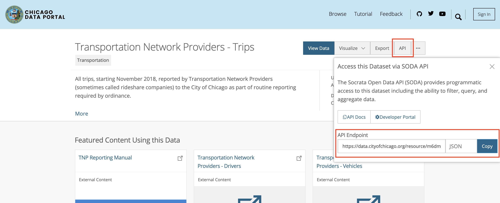

# Adding a New Dataset

How to add a new dataset to the offline pipeline.

## Related Docs

These docs make help you while going through this guide:

- [Extract, Transform, and Load (ETL)](etl.md)
- [Makefiles](makefiles.md)
- [Socrata Query Language (SoQL)](soql.md)

## Overview

There are three steps to add a new dataset to our offline pipeline:

1. Extract data from external sources
    - Write the code to extact a dataset
    - Add the extract step to `Makefile`
    - Run the extract step to check if it worked
2. Transform data into the desired format
    - Write the code to transform a dataset
    - Add the transform step to `Makefile`
    - Run the transform step to check if it worked
3. Load data into the database
    - Write a SQLite schema for the new table
    - Add the load step to `Makefile`
    - Run the transform step to check if it worked

For example, here is how the rideshare dataset fits into the offline pipeline:


## 1. Extract

- Code used to extract data should go in the `pipeline/extract/` directory.
- Data produced by extract steps should go in the `pipeline/data/extracted` folder.

There are three external sources we extract data from:

- A. [Chicago Data Portal](https://data.cityofchicago.org/)
- B. [Chicago Health Atlas API](https://chicagohealthatlas.org/api/v1/)
- C. Raw URL

Figure out where the dataset you want to extract comes from and read the corresponding subsection.

### A. Extracting from the Chicago Data Portal

The Python script `pipeline/extract/from_data_portal.py` helps you extract data from the data portal by writing a SoQL query.

- Find the dataset you want to extract from [the data portal](https://data.cityofchicago.org/)
- Get the JSON URL for the dataset
    - Find the API button in the top-right corner, select the JSON endpoint, then click copy



- Write a SoQL query to get the data you want
    - Read [Socrata Query Language (SoQL)](soql.md) for a guide on how to write and run queries
- Write a `Makefile` step in the extract section

An example of a dataset extracted from the data portal is the rideshare data. This is its `make` step:

```make
PORTAL_RIDESHARES := https://data.cityofchicago.org/resource/m6dm-c72p.json

data/extracted/daily_rideshare.csv:
    python3 extract/from_data_portal.py \
        --json_url="$(PORTAL_RIDESHARES)" \
        --soql_file="extract/daily_rideshare.sql" \
        --output_file="data/extracted/daily_rideshare.csv"
```

To use the `extract/from_data_portal.py` script, your step should specify the following information:

- Output file path, as both the target and as a CLI flag, e.g. `data/extracted/daily_rideshare.csv`
- Data portal JSON URL, defined as a variable at the top of the `Makefile`
- SoQL query file path, e.g. `extract/daily_rideshare.sql`

Usually, extract steps don't depend on other `make` steps.

### B. Extracting from the Chicago Health Atlas API

We use the Python `requests` module to make requests to an API. Create a new script under the `pipeline/extract/` directory.

An example of a dataset extracted from an API is the demography data. You can refer to `pipeline/extract/demography.py` as an example of how to make a request for every community area. Here is an example of the code:

```python
import requests

API = os.environ.get("CHICAGO_HEALTH_ATLAS_API")

slug = "bridgeport"
r = requests.get(f"{API}/place/demography/{slug}")
data = r.json()
print(data)
```

The API URL is set as an environment variable by `Makefile`. Then we make a `GET` request to the endpoint for a specific community area based on its slug name. Then we get the response data as JSON and save the information we want.

This is the `make` step for the demography:

```make
data/extracted/demography.csv: data/transformed/community_area.csv
    python3 extract/demography.py \
        --areas_file="data/transformed/community_area.csv" \
        --output_file="data/extracted/demography.csv"
```

This is an example of an extract step that depends on another `make` step. In fact, it depends on a transformed dataset.

### C. Extracting from a Raw URL

An example of a dataset extracted from a raw URL is the ZIP code to community area equivalency file. We download it using `curl`. This is its `make` step:

```make
ZIP_CODE_TO_COMMUNITY_AREA_URL := https://docs.google.com/spreadsheets/d/1oHZy7sDlpZmCvymCg0mcd_bDBj-tn8oorsOmuo8odZI/export?format=csv&gid=0

data/extracted/zip_code_to_community_area.csv:
    curl -J -L "$(ZIP_CODE_TO_COMMUNITY_AREA_URL)" \
        --create-dirs -o "data/extracted/zip_code_to_community_area.csv"
```

The `curl` command has several CLI flags:

- `-L` tells curl to follow redirects until it reaches a file
- `-J` tells curl to get the file type from the file content instead of the URL
- `--create-dirs` tells curl to make the output folder if it doesn't exist
- `-o` tells curl the output path to save the downloaded file to

## 2. Transform

Coming soon...

## 3. Load

Coming soon...
