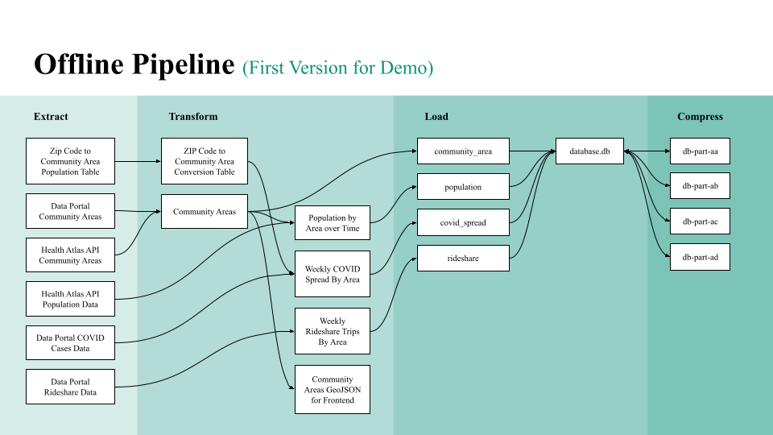

# Extract, Transform, and Load (ETL)

## Overview

A **pipeline** is a series of data processing steps. One common way to organize pipeline steps is using **ETL**.

ETL stands for extract, transform, and load.

- **Extract:** to get data from an external source
- **Transform:** to convert data from one form to another
- **Load:** to export data for other systems to use

For example, our offline pipeline is an ETL pipeline:

## Thinking in ETL

ETL provides a common way to break down data processing problems. For example:

- If you want to build a dashboard for breaking news headlines:
    - You might **extract** news headlines from some source (maybe from an API, maybe by scraping a website, maybe by having people submit headlines through a form)
    - You might **transform** those headlines to get metadta (maybe the topic, maybe the month/year, maybe the frequency of certain terms)
    - You might **load** the results into another service (maybe a website that shows your dashboard, maybe into a database of training data for some model)

Breaking a process into ETL steps can make it easier to:

- Write and test steps
- Manage dependencies
- Make changes and update affected future steps
- Debug a pipeline and pinpoint failure points
- Describe what a pipeline does at a high-level
- Add new extracted data sources
- Add new steps to transform data
- Add new services that use the loaded data

## ETL with Make

When working with large datasets or complicated code, any individual data processing step could take a long time. If there is an error or an update, we would like to only re-run those steps that are affected. We use a tool called `make` to manage this, you can learn more in [the Makefiles guide](makefiles.md).
