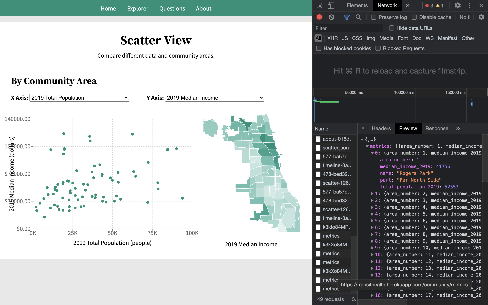

# Inspect API Requests

**Note:** For a refresher on concepts related to RESTful APIs, check out [the terminology section](new_endpoint.md#terminology) of the guide on adding new endpoints to our backend API.

We use unit tests to verify our implementations of API logic, that way we don't have to start up a server and send requests every time we want to test it. However, even if the unit tests pass, requests may still fail if there is a bug in the code that handles the endpoint.

To test out API requests and inspect their details for debugging or learning, we will mainly use two methods:

- [Browser DevTools](#using-browser-devtools)
- [Specialized API Tools](#using-specialized-api-tools)

If you notice something a problem with the API logic while testing requests to an endpoint this way, think of a way to fix it. It may be possible to write a unit test for this case, or a functional test may be needed.

It is also sometimes okay to send a pull request to fix the problem even if no test is added. In that case, having the fix peer reviewed by another engineer __is__ the way we test that the change does what we expect.

## Using Browser DevTools

You can test your endpoint in your browser. For a `GET` request, you can go to the URL where the API is being served.

For example, there is an endpoint `GET /count/:table_name` that returns the count of rows in a table of the given name. If your server is running locally on port 5000, you can try this request by navigating your browser to `http://localhost:5000/count/income`.

For `POST` requests, you can [start up the frontend app](../app/README.md) and go to a page that sends requests to the endpoint you want to try.

For example, we can try [the `POST /community/metrics` endpoint](new_endpoint.md#a-endpoint-implementation) we studied in the guide on how to add a new endpoint.

- Go to [the Community View page on our production website](https://scarletstudio.github.io/transithealth/scatter).
- Open the browser developer tools. If you are using Chrome, right-click on the page and select "Inspect element" from the options.
- The developer tools panel will pop up. Click on the "Network" tab.
- Select one of the median income metrics in the app for the Y-Axis.
- In the network tab, the request will appear in the table of requests. Click on it.
- Use the sub-tabs to navigate between the headers, preview, request, timing, and other information.

## Using Specialized API Tools

You can use a specialized tool like [Insomnia](https://insomnia.rest) or [Postman](https://www.postman.com) to send a request and get the response. Many software development teams use these kinds of tools to help design and test API without having to bring up the client app. In this case, the tool serves as its own client.
