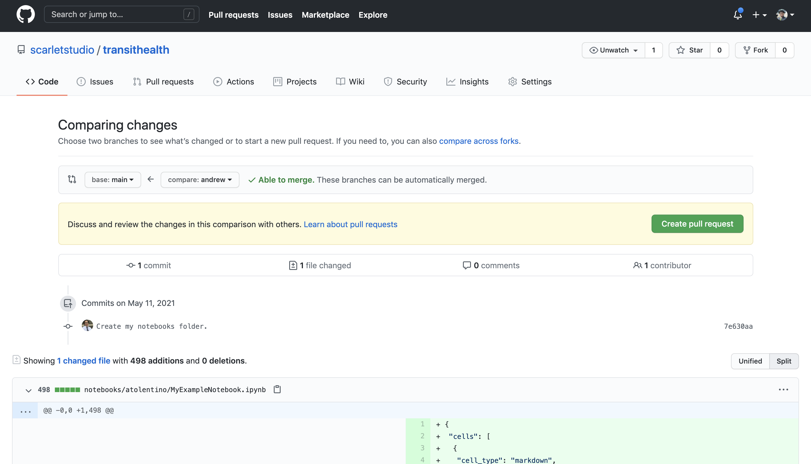

# Setup

The project is broken up into three main systems:

1. Frontend App: what the user sees
2. Backend API: how the app gets data
3. Offline Pipelines: how we process the data

All three of these systems are part of this codebase. This guide will help you install and run all three parts.

## Using the Command Line

We will set up the project codebase using the command line. Open a terminal window to follow these steps.

When you see a code block like this, unless otherwise stated, each line is a command to enter into your terminal.

```bash
# This command will list all the folders and files in your current directory.
ls
```

## 1. Clone Repository

The code for this project is hosted on GitHub. If you do not have a GitHub account, visit [the website](https://github.com) to create one.

We will use git for version control: tracking different versions of our code and collaborating on development. If git is not installed on your computer, [download it here](https://git-scm.com/downloads).

If you have not used git before, configure your name and email.

```bash
git config --global user.name "Your Name"
git config --global user.email "Your Email"
```

Clone the repository and use `cd` to enter the folder. This first clone can take 4-10 minutes because you are also cloning the compressed database files.

```bash
git clone git@github.com:scarletstudio/transithealth.git
cd transithealth
```

Now that you have the codebase cloned, you can install and run the app. Later, you will make your own changes and **commit** and **push** them, which is how we send our changes to the main repository.

## 2. Set Environment Variables

Environment variables help us configure our programs without changing code.

Run this command to create an environment configuration file:

```bash
touch .env
```

Then open the file in the text editor of your choice and add these contents:

```
# Tells the server what port to serve the API on
API_PORT=5000
# Tells the server what origins to accept requests from (comma-separated list, if multiple origins)
ALLOW=http://localhost:8001
# Tells the server where to find the SQLite database file
DATABASE=pipeline/database.db
```

Our frontend app uses a special kind of environment configuration file, called `.env.local`. Create this file in the `app/` directory.

```bash
touch app/.env.local
```

Then open the file in the text editor of your choice and add these contents:

```
# Tells the frontend app where to send requests to for the backend API (no slash at the end)
NEXT_PUBLIC_API=http://localhost:5000
```

Sometimes these files contain secret information (not the case for our project), like database passwords, so we do not want these files to be committed to the repository. If you look at the file `.gitignore` and search for `.env`, you will find that we have told git to ignore both of these files.

- If you run the frontend app on a different URL or port number, update your `.env` file to make sure it is in the `ALLOW` list for the backend API.
- If you run the backend API on a different URL or port number, update your `app/.env.local` file to make sure it is set as the `NEXT_PUBLIC_API` so the frontend app can reach it.

## 3. Create Virtual Environment

Now we can set up the Python parts of our project. If Python and its package manager pip are not on your system, visit [the website](https://www.python.org/downloads/) to install them.

Virtual environments allow us to manage the dependencies of our project, without affecting the rest of our computer.

### Commands to Run the First Session Only

If the virtual environment package for Python is not installed, you can install it with pip:

```bash
pip3 install virtualenv
```

Create a virtual environment, which will be stored in a folder called `.venv/`.

```bash
virtualenv .venv
```

If the above command does not work, try this:

```bash
python3 -m virtualenv .venv
```

### Commands to Run Every Session

Activate the virtual environment. You will do this at the start of every session.

```bash
source .venv/bin/activate
```

If your virtual environment is active, you will see `(.venv)` at the left of your terminal line.

At the end of your session, you can deactive the virtual environment by typing:

```bash
deactivate
```

## 4. Install Backend Dependencies

Install the project Python dependencies.

```bash
pip3 install -r requirements.txt
```

## 5. Install Frontend Dependencies

Change directories to the `app/` folder.

```bash
cd app
```

We will use Yarn, a package manager for Node.js. If Node.js is not on your system, visit [the website](https://nodejs.org/en/download) to install it first. It is recommended to use Node version 14 or higher for running our frontend app.

Then, if Yarn is not on your system, visit [the website](https://classic.yarnpkg.com/en/docs/install) to install it.

Now you can install the project JavaScript dependencies.

```bash
yarn install
```

After the installation succeeds, go back up to the project root directory.

```bash
cd ..
```

## 6. Run Offline Pipeline

Our offline pipeline pulls in data from outside sources, processes it, and creates our database. The pipeline is run by a tool called Make.

For more information about the offline pipeline directory structure, visit its [README](../pipeline/README.md).

Make should already be installed on Linux or Mac systems. If it is not installed on your Windows machine, visit [this website](http://gnuwin32.sourceforge.net/packages/make.htm) to install it.

Make sure that your virtual environment is activated and that you are in the `pipeline/` directory.

```bash
source .venv/bin/activate
cd pipeline
```

Run this command to unpack the compressed database into a file that the backend can read.

```bash
make uncompressed
```

Running the entire offline pipeline from scratch can take a while. You can skip this step for now:

```bash
# This will delete the database and run the entire database from scratch, which can take a long time
make clean && make
```

After unpacking the compressed database, go back up to the project root directory.

```bash
cd ..
```

## 7. Run Backend API

Our backend API serves requests to the frontend and computes metrics from the database produced by the offline pipeline.

For more information about the backend API directory structure, visit its [README](../api/README.md).

You can run the API from the project root directory. Make sure your virtual environment is activated.

```bash
source .venv/bin/activate
```

Use this command to run the server in development mode. If you make changes, it will automatically reload.

```bash
FLASK_APP=api/server.py FLASK_DEBUG=1 FLASK_ENV=development flask run
```

Now you can open `http://localhost:5000` in your browser. You get see a welcome message telling you the API is active.

> If you run the backend API on a different URL or port number, update your `app/.env.local` file to make sure it is set as the `NEXT_PUBLIC_API` so the frontend app can reach it.

If this command does not succeed, check:

- That your virtual environment is activated (Step 3)
- That the Python dependencies are installed (Step 4)
- That your `.env` file is present in the project root directory and has the correct values with no extra whitespace (Step 2)

Keep the server running and open a new terminal to run the frontend app for step 8.

Later, you can stop the server by pressing `Cmd + C` or `Ctrl + C`. You may have to press twice.

## 8. Run Frontend App

Our frontend app helps users visualize data and sends requests to the backend API.

For more information about the frontend app directory structure, visit its [README](../app/README.md).

Change to the `app/` directory to run the frontend app.

```bash
cd app
```

Use this command to start the app in development mode. If you make changes, it will automatically reload.

```bash
yarn dev
```

Now you can open `http://localhost:8001/transithealth` in your browser. You should get the app home page.

> If you run the frontend app on a different URL or port number, update your `.env` file to make sure it is in the `ALLOW` list for the backend API.

If this command does not succeed, check:

- That the Node.js/Yarn dependencies are installed (Step 5)
- That your `.env.local` file is present in the `app/` directory and has the correct values with no extra whitespace (Step 2)
- That you put `/transithealth` at the end of your URL

You can stop the frontend by pressing `Cmd + C` or `Ctrl + C`. You may have to press twice.

After running the app, go back up to the project root directory.

```bash
cd ..
```

You can close this terminal and return to the terminal that was running the backend API server. Shut down that server and proceed to step 9 to run the Jupyter notebook server.

## 9. Run Jupyter Notebook

Jupyter notebooks allow us to write Python (and other languages, like SQL!) and interact with the output. They are a great tool for data exploration, debugging, and prototyping.

Create a new folder with your username. This is where your notebooks will live. Change the command below to replace `YOUR_HAWK_USERNAME` with your Hawk username. By convention, folder names are lowercase.

```bash
mkdir notebooks/YOUR_HAWK_USERNAME
```

Copy the example notebook into your folder. Change the command below to replace `YOUR_HAWK_USERNAME` with your Hawk username.

```bash
cp "notebooks/example/Example Notebook.ipynb" "notebooks/YOUR_HAWK_USERNAME/My Example Notebook.ipynb"
```

You can start the Jupyter notebook server from the project root directory.

```bash
python3 -m notebook
```

This will open a page in your browser with all the folders in our project. Click on the `notebooks/` folder and then open your folder. Click on your example notebook to launch it.

Using this command also ensures that the notebook server launches with our Python virtual environment, so you can use any module we have installed.

Run through the commands in the sample notebook. Click `Shift + Enter` to execute a cell. You can also do this step later.

Press the save icon in the top left corner of your notebook.

You can stop the notebook server by pressing `Cmd + C` or `Ctrl + C`. You may have to press twice.

## 10. Create Your First Branch

### Get Write Access to the Repository

Before starting this step, contact your mentor or Vinesh to get write access to the GitHub repository, which will allow you to push your branch and work on the project. Let them know your GitHub username. You can find this on your GitHub profile or in the URL of your GitHub account page.

### Push Your Branch

Now that you have made some changes, you will **commit** and **push** them to the main project repository.

First, we will create a new branch. Putting your change on a different branch allows you to work while others make changes to the repository and lets you submit your work for review, before merging it into the main repository.

Replace `YOUR_BRANCH_NAME` with `first_branch_YOUR_HAWK_USERNAME` where `YOUR_HAWK_USERNAME` is your Hawk username. By convention, branch names are lowercase.

```bash
git checkout -b YOUR_BRANCH_NAME
```

Run this command to check what files have been changed. They should show as "not staged for commit." The only change should be the notebooks folder you added and your new example notebook. If you see other changes, ask for help.

```bash
git status
```

Use this command to add all of the changes to your commit. When you check the status again, they should show as "to be committed."

```bash
git add -A
git status
```

Create a commit and add a commit message.

```bash
git commit -m "Create my notebooks folder."
```

Now try to push the commit to the repository.

```bash
git push
```

The first time you push a commit from a new branch, it will fail and tell you that the branch is only on your local machine, not on the remote repository. Git will show you a command in the failure output. Run that command to push your branch to the repository. From then on, you will be able to push commits from this branch. The command will be like this:

```bash
git push --set-upstream origin YOUR_BRANCH_NAME
```

### Open a Pull Request

After pushing, open a pull request so we can merge your new notebook folder into the main branch.

- Go to [the project repository on GitHub](https://github.com/scarletstudio/transithealth)
- Click on the **Pull Requests** tab
- Click **New pull request** in the top-right corner
- Select your branch name from the dropdown labeled **compare**
- Leave **main** as the value for the dropdown labeled **base**
- Click **Create pull request** in the top-right corner
- Fill out the title and description of your pull request
- Click **Create pull request** in the bottom-right bellow the description
- Ask your mentor to review and merge the pull request




## Congratulations!

You made it through all the setup steps! Now you are ready to start contributing to the project.
